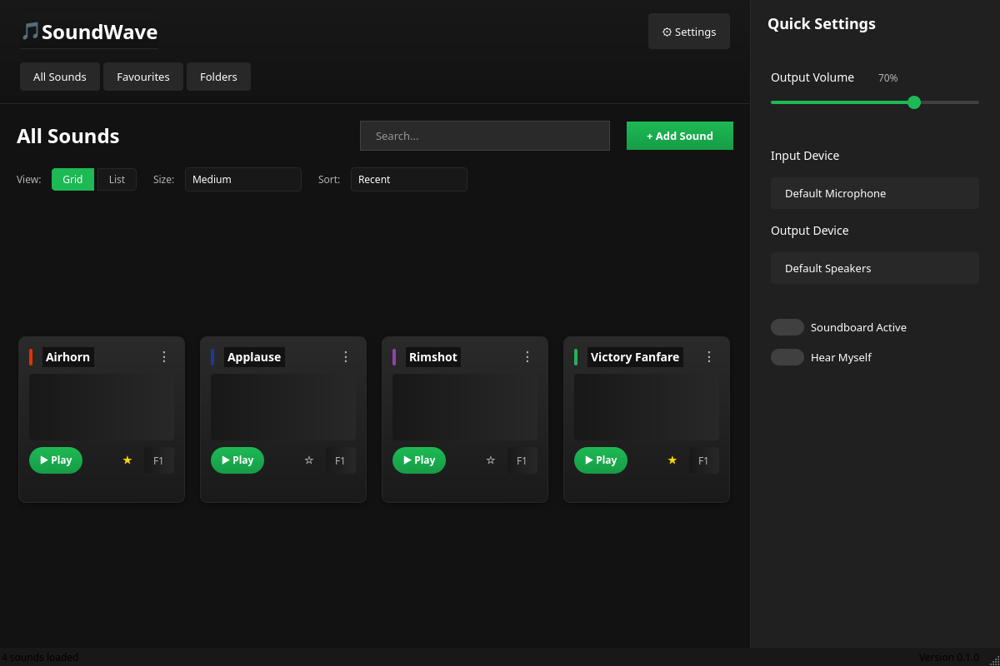

# Soundboard

> A modern Windows soundboard for streamers and presenters — trigger sounds with hotkeys, organise into folders, manage favourites, and persist between sessions. Built with Python and PyQt6.

[](https://github.com/OneAutumnLeaf4700/Soundboard-Program/actions/workflows/tests.yml)
[](https://github.com/OneAutumnLeaf4700/Soundboard-Program/releases)
[](https://www.python.org/)
[](LICENSE)



## Features

- 🎵 **Multi-format audio** — MP3, WAV, OGG, FLAC, and anything pydub can decode
- 🖱️ **Modern PyQt6 UI** — dark theme, gradient cards, grid + list views
- 📁 **Folder organisation** — group sounds by category with a sidebar folder view *(currently shows sample data — see Known Limitations)*
- ⭐ **Favourites** — pin frequently used sounds to a dedicated tab
- 💾 **Persistent storage** — sound metadata stored as JSON in `~/.soundboard/sounds.json`
- 🎚️ **Audio device selection** — route output to any device exposed by `sounddevice`

## Tested platforms

- Windows 10 / 11 (primary target — prebuilt `.exe` available on the Releases page)
- Linux works from source (PortAudio + Qt platform plugins required)
- macOS untested

## Prerequisites

- **Python 3.8+** (only needed for running from source)
- **PortAudio** — required by `sounddevice` for output. Bundled with the prebuilt `.exe`. On Linux: `sudo apt install libportaudio2`. On macOS: `brew install portaudio`.

## Installation

### Option 1 — Prebuilt Windows executable (recommended)
1. Go to the [Releases](https://github.com/OneAutumnLeaf4700/Soundboard-Program/releases) page
2. Download the latest `Soundboard.exe`
3. Double-click to run

### Option 2 — From source
```bash
git clone https://github.com/OneAutumnLeaf4700/Soundboard-Program.git
cd Soundboard-Program
python -m venv venv
source venv/bin/activate          # Windows: venv\Scripts\activate
pip install -r requirements.txt
cd soundboard/src
python main.py
```

> Run from `soundboard/src` — that's the directory `main.py` expects to be its working directory for its relative imports.

## Usage

1. **Launch** — the main window opens with empty Sounds, Favourites, and Folders tabs
2. **Add sounds** — use the *Add Sound* button to import audio files; the app stores their metadata in `~/.soundboard/sounds.json`
3. **Play** — click any sound card to play it; click again to stop
4. **Organise** — create folders in the Folders tab and drag sounds into them
5. **Favourite** — right-click a sound and choose Favourite to pin it to the Favourites tab
6. **Audio device** — pick output device in Settings (uses sounddevice's enumeration)

Set the env var `SOUNDBOARD_DEBUG=1` before launching for verbose logging.

## Development

### Setup
```bash
git clone https://github.com/OneAutumnLeaf4700/Soundboard-Program.git
cd Soundboard-Program
python -m venv venv
source venv/bin/activate
pip install -r requirements.txt
pip install -r requirements-dev.txt
```

### Run tests
```bash
pytest --cov=soundboard/src --cov-report=term-missing
```

### Project layout
```
Soundboard-Program/
├── soundboard/
│   ├── pyproject.toml
│   └── src/
│       ├── main.py                     # Entry point — configures logging, launches GUI
│       ├── managers/
│       │   ├── audio_player.py         # sounddevice + pydub playback
│       │   └── sound_manager.py        # CRUD over sounds + favourites
│       ├── models/
│       │   └── sound_model.py          # JSON persistence at ~/.soundboard/sounds.json
│       └── ui/
│           ├── main_window.py          # Main window, COLORS palette
│           ├── sound_card.py           # Single-sound widget
│           ├── sound_grid.py           # Grid layout for sound cards
│           ├── folder_view.py          # Folder sidebar
│           └── components.py           # Reusable widgets
├── tests/                              # pytest suite
├── docs/                               # Screenshots, design notes
├── .github/workflows/                  # CI: tests, build/release
├── requirements.txt                    # Runtime deps
├── requirements-dev.txt                # Test/lint deps
└── LICENSE
```

## Known Limitations

**Folders tab shows sample data, not your real sounds.** The Folders view currently renders a hardcoded demo folder structure rather than reading from your actual sound library — folder assignment isn't wired to the persistence layer yet. All Sounds and Favourites both reflect your real, persisted data correctly.

## Troubleshooting

**"No audio output device found".** Install PortAudio — see Prerequisites. On Linux, also confirm your user is in the `audio` group.

**Playing a sound does nothing.** Check the log (`SOUNDBOARD_DEBUG=1`); `pydub` may have failed to decode the file. MP3 / WAV / OGG / FLAC should all work; some exotic codecs require ffmpeg.

**Sounds don't persist between sessions.** The app writes to `~/.soundboard/sounds.json`. If that path isn't writable (e.g. running on a locked-down system), persistence will silently fail — check the log for `Error saving sound data` lines.

**Wanted to delete a sound but Edit option is missing.** Sound editing isn't implemented yet — only Delete and Favourite are wired up. Open an issue if you'd find Edit useful.

## Contributing

Issues and PRs welcome. Please:
- Open an issue first to discuss any non-trivial change
- Run `pytest` and ensure tests pass before submitting
- Follow PEP 8 (formatted with [black](https://black.readthedocs.io/))

## License

[MIT](LICENSE) © 2026 Rayyan
